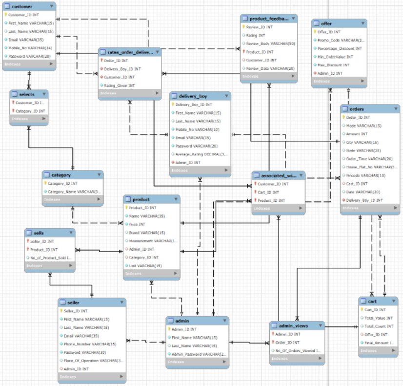
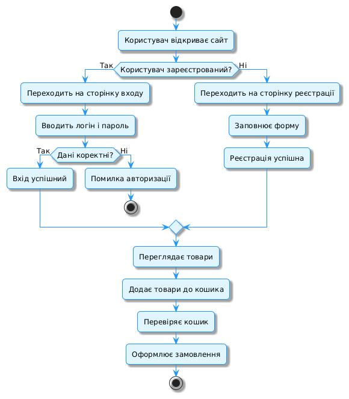
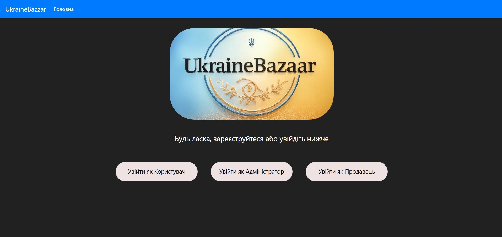
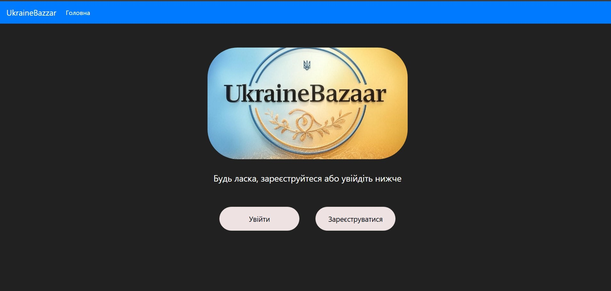
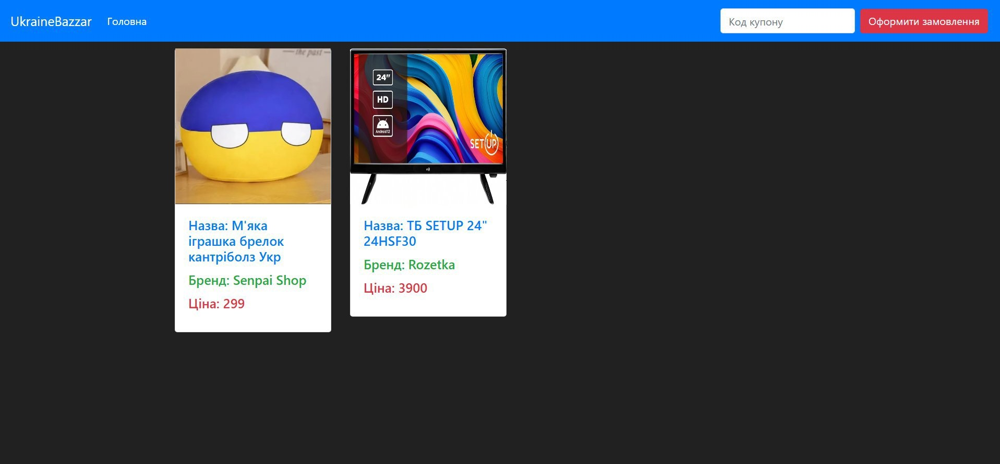
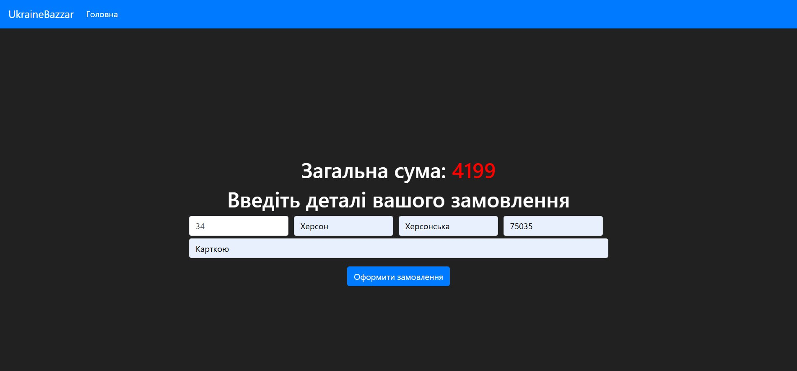
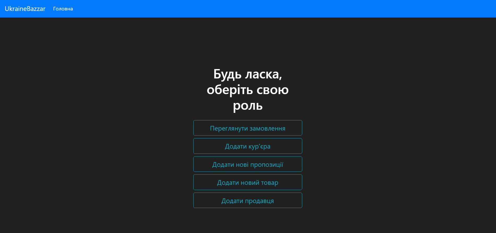

# Flask-MySQL-webshop

This project is an online store system built with Python (Flask) and MySQL. 
It includes database structure, user roles, product management, orders, carts, offers, and delivery system.

## Development Tools


## Technologies


## Features

### Admin
* Manage products and categories
* View orders and analytics
* Manage delivery staff
* Create discount offers

### Customer
* Browse products
* Add products to cart
* Place orders
* Leave reviews and ratings

### Seller
* Manage product listings
* Track sales

### Delivery
* Assign and track orders
* Rating system for delivery performance

---

## Screenshots

### DB


### Activity Diagram


### Main Page


### Entrance Selection


### Store Products


### Shopping Cart


### Order Details


### Admin Panel


---

## Database Structure

The database `online_store` includes the following main tables:

- admin
- customer
- seller
- delivery_boy
- product
- category
- cart
- orders
- offer
- product_feedback
- rates_order_delivery
- selects
- sells
- associated_with
- admin_views
- rating_table (view)

The schema supports:
- Product catalog with categories
- Shopping cart system
- Order management
- Delivery tracking
- Product reviews and ratings
- Discount offers
- Admin analytics

---

## Setup Instructions

### 1. Clone the repository

```bash
git clone <repo_url>
cd <project_folder>
```

### 2. Create database

Open MySQL and run:
```
CREATE DATABASE online_store;
USE online_store;
```

Then import the dump file:
```
mysql -u root -p online_store < dump.sql
```

### 3. Configure database connection

Create a file named database.yaml:
```
mysql_host: localhost
mysql_user: root
mysql_password: 1234
mysql_db: online_store
```

### 4. Install dependencies

```
pip install -r requirements.txt
```

### 5. Run the application
```
python app.py
```
or
```
python run.py
```
